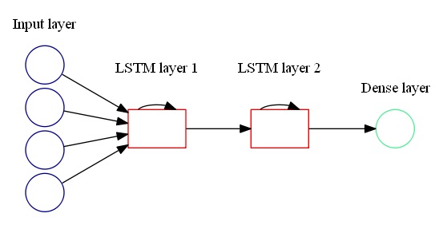
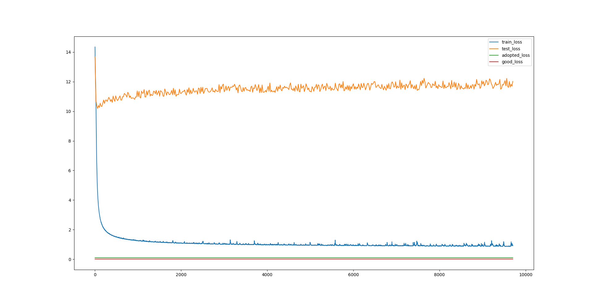
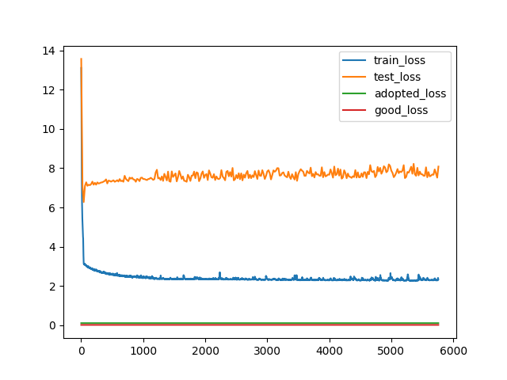
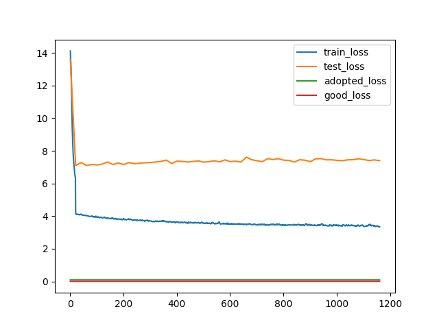

# Research Plan
## 1. Objective
A new threading method based on profile of sequence, describes  long-range interaction information 
## 2. Motivation

Describing long-range interaction information  is difficult.

Profile-profile considers more on position specific, assume position independently.

Context-specific profile and HMM-HMM consider more on local relative information.

MRF utilizing long-range interaction information still exist some problem 

RNN can deal with sequence and characterize long-range interaction information. Use RNN to characterize protein sequence may be a good idea.

## 3. Method

Firstly, use RNN to extract new represention from PSSM, then use extracted new represention to build a new sequence model.
##### 3.1 Obtain new represention
-1. Transform PSSM into vector as RNN input form
    > Adopt profile produced by HHsearch

-2. Use biLSTM to build a new autoencoder-like neural-network model and predict next position output
    > Input: PSSM[i-M:i] outPut PSSM[i]\
	> Loss function: MSE

-3. Extarct hidden layer nodes values as new profile representation and get a kind of profle-like matrix
##### 3.2 Usage of extracted new represention
1. Use the profle-like matrix as profile. For example, build proflelike-profilelike align method.
2. Build a supervised neural network model, adopt new representation as input.
3. use profle-like matrix as a new kind of feature.

## 4. Experiment
##### 4.1 Experiment 
###### 4.1.1 Data
	- Database: PDB70
	- Numuber of PSSM: 37602

###### 4.1.2 Model
> First, adopt a simple model, use a one-way LSTM network, as below:
>>

>>Input: $PSSM[i-4:i][0:20]$ （80 dimension）
>
>>Output: $PSSM[i+1][0:20]$ （20 dimension）
>
>>Loss function: for each sequence，$\frac{\sum_{i\leq len(PSSM)}\sum_{j\leq20}(PSSM_{ij}^{truth}-PSSM_{ij}^{predict})^2}{len(PSSM)}$

###### 4.1.3 Process
data too much to load to all, select part of data, 10000 sequences, random
8000 for traing, 2000 for test.
###### 4.1.4 Result
best training loss: 1.030    testing loss：1.313
###### 4.1.5 Evalution:
Obviously, the predict result is terrible. (the most terrible loss is 2.0)
For the result, these things may do some explaination:
1. Data is too long and length is different,so that speed of training data is too sparse.
2. Lack of Model Evolution Criteria, difficult to evelute the train model is good or bad.

Assume exist an good model evolution criteria， how to train a NN model is still a problem.

##### 4.2 Improvement 
Consider effectiveness of data, more meaningful data has more information. For profile, which produced from more sequences(better MSA) has more information. Therefore consider filter profile to choose more meaningful data will make more sense.
###### 4.2.1 Process
Filter profile from all 37602, and then choose profile produced from more than N sequences.
###### 4.2.2 Data
    - Database: PDB70
    - Numuber of PSSM: 17833
    - Filter Critria: MSA >= 500 seqs and length <= 300

###### 4.2.3 Result 
###### 4.2.3.1 Result chart
| sum_sequence(training size,testing size) | small model(parameters,training loss,testing loss)  | medium model(parameters, training loss,testing loss) |
| ------------- |:-------------:| -----:|
| 2(2, 0)     | (91760, 0.000151, --) | (--, --) |
| 10(10, 0)     | (91760, 0.000213, --) | (--, --) |
| 1000(800, 200)    | (247620, 0.00977, 0.11690)      |   (326540, 0.00911, 0.12023) |
| 10000(8000, 2000)  |    |   (567920,0.02072, 0.08532)   |
| 17833(14260, 3573)  |  |(875540,0.03495, 0.07338)

Notice: the all model in result chart is all different model.
###### 4.2.3.2 Loss Figure
> Figure 1: seqs 1000 - medium model 

>(horizontal coordinates: epochs.   vertical coordinates 100*loss)

Compare the training loss in this chart with the best loss of neural network with 10 sequences, find that fitting 1000 sequences is difficult. 
For the reason, one explaination is that 1000 sequence is very complex, so that a NN model with 326540 parameters can't overfitting very well.  
230 epochs later, testing loss is always pretty high and don't change much. Both of them mean the model don't have generalization ability.
> Figure 2: seqs 10000 - medium model

>
>(horizontal coordinates: epochs.   vertical coordinates 100*loss)

Compared this figure with Figure 1, we find that, although the NN model has more fitting ability, training loss still increases much. it means such NN model is not complex enough to overfitting 10000 data and regular is difficult. 
The testing loss line become lower a bit. It means the model has learn something, but we don't konw what it is :( .
> Figure 3: seqs 17833 - medium model

Compared this figure with Figure 2, we find that, although the NN model has more and more fitting ability, training loss still increases. it means the regular pattern in  is difficult. 
The testing loss don't decrease much, compared with Figre 2.  More data may be not able to get more generlization, because we may don't do tuning parameters well.
###### 4.2.4 Evaluation and Conclusion
The result have some improvements, but it still can't be used for extarct representation.
For each column in PSSM, the training loss is stll much high. Because the average value of the each position is 0.05.
For the best result of training loss 0.02072:
$$\sqrt{0.02072/20} =  0.03218$$
###### 4.2.5 Explanation and Question
-1. One way style(from PSSM[i-M:i] to predict PSSM[i]) may be not a good method. 
	> Try two way style(from PSSM[i-M/2:i] and PSSM[i:i+M/2] to predict PSSM[i])
	> Use the same 1000 sequences in Figure 2 used, compared with Figure 2, don't change much.
-2. Non-conservation position may can't be predicted from arround.
	> Improvement: Adopted supervised style NN model.
-3. PSSM[i] may can't be  predicted from PSSM[i-M:i] or (PSSM[i-M/2:i] and PSSM[i:i+M/2])
	> Improvement: Adopted supervised style NN model.
-4. Whether the predicted representations in conservation positions of PSSM is alike.
	> Use 2 sequences wich exist the same family but different superfamily from SCOP database.
	> Build PSSM by HHblits, extracted predicted representations from NN model(seqs 10000 - medium model).
	> Observe the result, the predicted representations in conservation positions is different.
-5. Whether the accuracy of the predicted output in conservation positions of PSSM is high.
	> Use NN model(seqs 10000 - medium model), to test 10 PSSM not used to train NN model(seqs 10000 - medium model).
	> Observe the results by plotting bar chart, the predicted output is much different from the expected output in conservation positions of PSSM.
###### Improve Direction
A supervised NN model. 
Contain elements: RNN, MSA, Supervised
## 5. Result
To compared with

profile-profile:PROF-SIM,COMPASS
context-specific:CS-BLAST
HMM-HMM:HHpred
long-range information:MRF
compare style: like MRFAlign
Evaluation Criteria:
- recall
- precision
- Homologo detection success rate
dataset:training,test:scop70

## 6. Conclution

